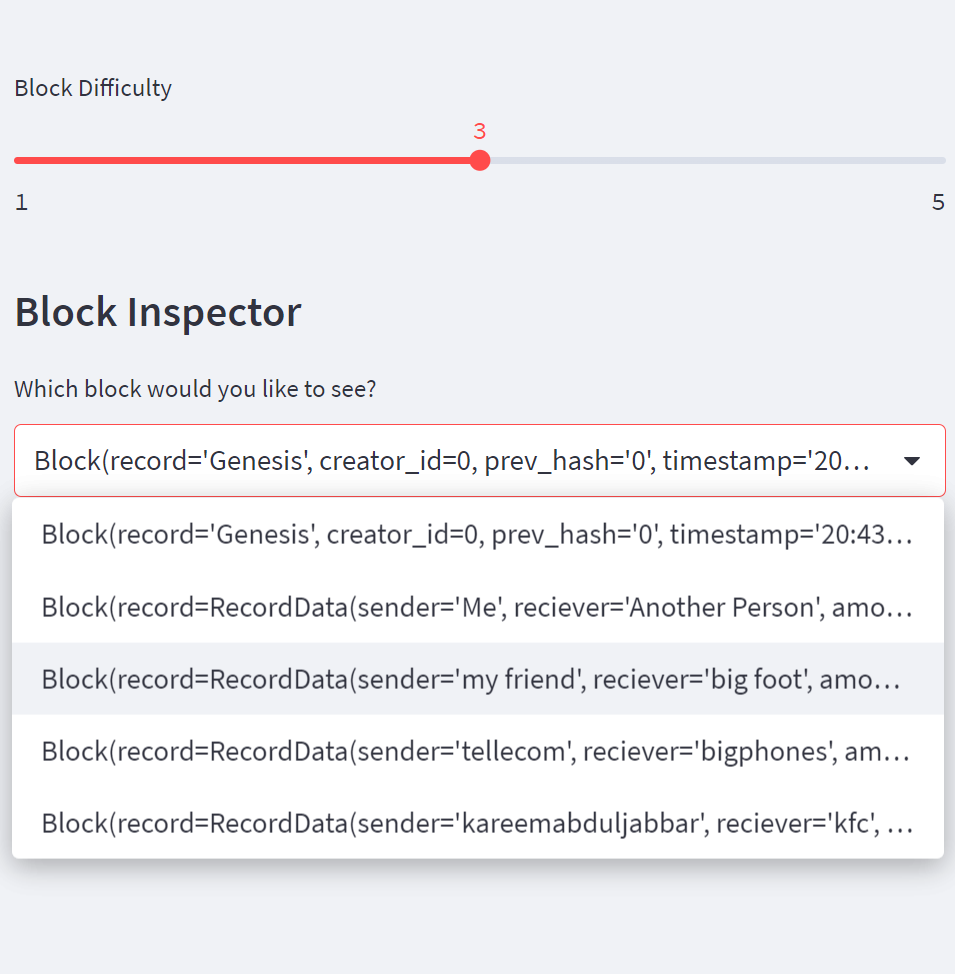
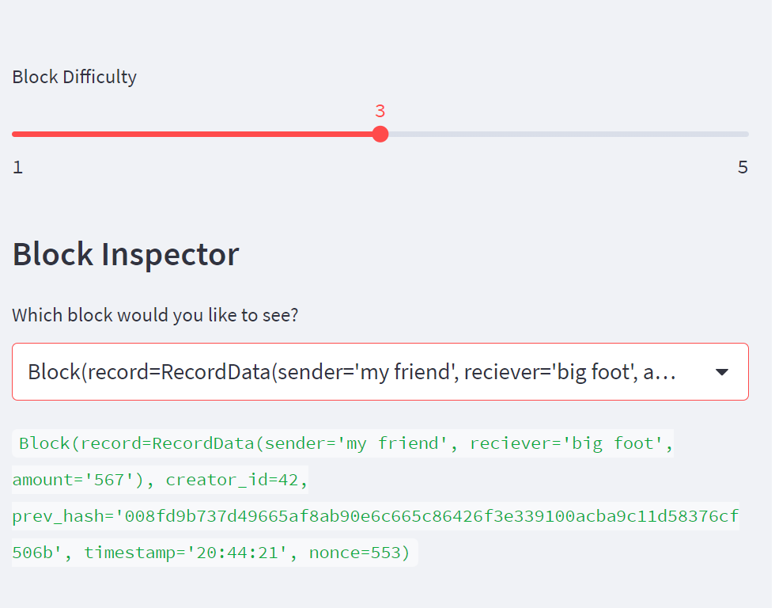
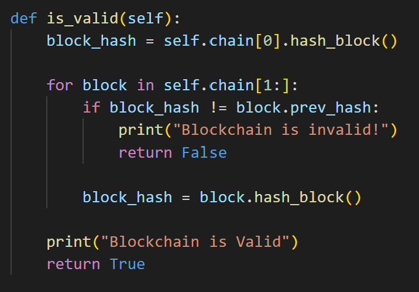
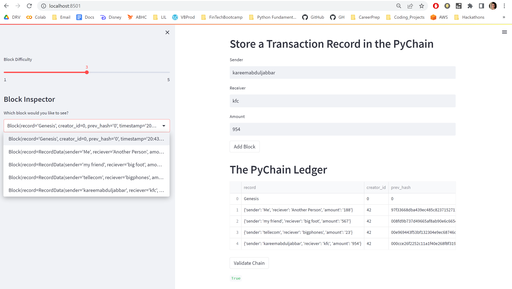
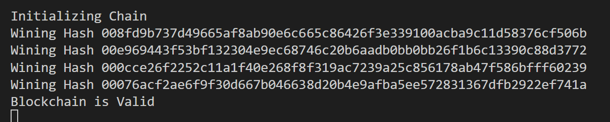

# Block_Chain_Ledger
Creates a viewable blockchain ledger in a Streamlit web application

---

## Technologies

Language: < Python 3.7

[Pandas](https://pandas.pydata.org/pandas-docs/stable/index.html) - For the creation and visualization of Data Frames

[Streamlit](https://streamlit.io/) - Powerful shareable web application tool for use with python

[Hashlib](https://docs.python.org/3/library/hashlib.html) - native python package for securing data through hashing

[Data Classes](https://docs.python.org/3/library/dataclasses.html) - Decorator for adding dunder methods to user created classes

---

# Installation Guide

Everything to run this code is mainly included with an installation of anaconda excluding 'Streamlit'. Additionally, you will need a [GitBash](https://git-scm.com/downloads) terminal

Go to the [anaconda](https://www.anaconda.com/) website to fully install python and its dependencies. This will include:
> **Pandas, Hashlib, Data Classes, etc**

A conda enviornment will need to be created. Go to your GitBash terminal and enter to create and activate your environment:
```python
    conda create --name myenv
    
    conda activate myenv
```
Note: 'myenv' can be any name you choose.

Next, you can use conda to install Streamlit. Enter:

```python
    conda install -c conda-forge streamlit
```

These are all the required packages you need to run this application.

---


## Overview
### * This application launches a local web application and allows the user to update an ongoing ledger
### * The ledger utilizes linked and hashed data to create a verifiable blockchain
### * The user can set the difficulty of each hash to create a more or less complex nonce for the hash to match before being added to the ledger
### * The user can go back and select different hashes in the ledger to verify all the information associated with each transaction

---

### Drop Down Menu
<div style="text-align: left"></div>
<div style="text-align: left"></div>


### Validation of Web Application
> There is an added feature that verifies each hash in the blockchain is linked to the previous hash to ensure security
<div style="text-align: left"></div>
<div style="text-align: left"></div>
<div style="text-align: left"></div>

## Contributors

Created by Silvano Ross while in the UW FinTech Bootcamp
> Contact Info:
> email: silvanoross3@gmail.com |
> [GitHub](https://github.com/silvanoross) |
> [LinkedIn](https://www.linkedin.com/in/silvano-ross-b6a15a93/)


---

## License

- [MIT](LICENSE)


